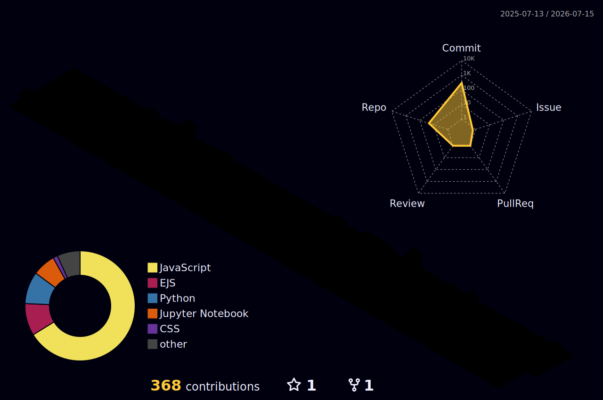

  

  

  

  

 

## 🚀 About Me
- 💻 Full-Stack Developer & AI/ML Enthusiast
- 🤖 Building intelligent web applications powered by AI
- 📚 Exploring Machine Learning, NLP, Computer Vision & Generative AI
- 🚀 Passionate about solving real-world problems through technology 

## 🛠️ My Tech Stack  

  

<!--  -->

<!-- 

&nbsp;
 -->
## 🏙️ My Contribution Skyline

  

## 📊 GitHub Stats
<!--   -->

 
<!--  -->

<!-- 

 -->
