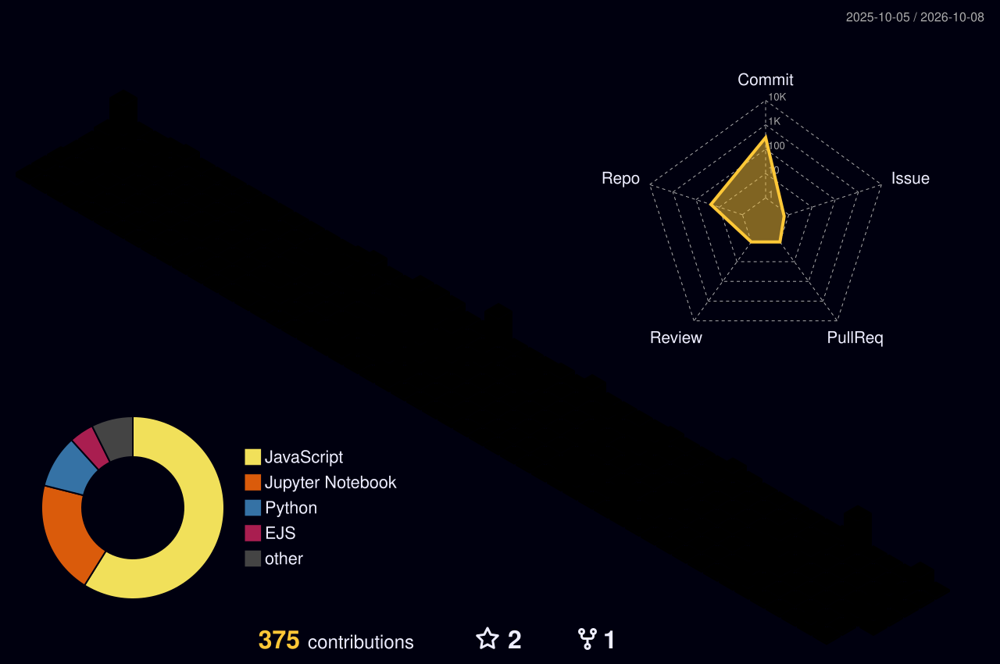

  

  

  

  

 

##  A little more about me...

- 📊 Aspiring Data Analyst with an interest in Business Analytics
- 🐍 Working with Python, SQL, Excel, Power BI and data visualization
- 🔎 Interested in uncovering patterns, trends and actionable insights from data
- 💡 Enjoy solving real-world business problems through data-driven analysis
- 🚀 Continuously learning analytics, statistics and machine learning

## 🛠️ My Toolkit

  

  
  
  
  
  
  

## 🏙️ My Contribution Skyline

  

## 📈 GitHub Stats

  

